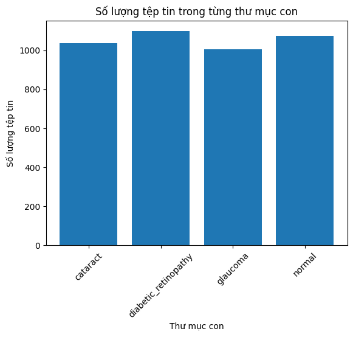
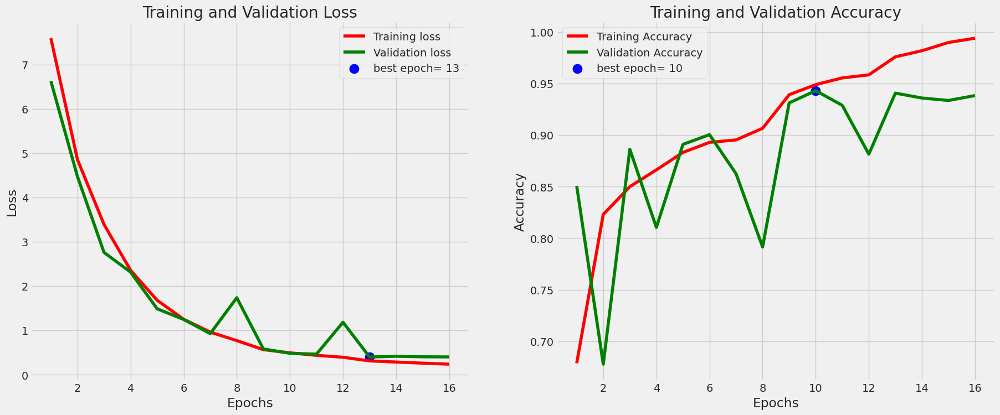
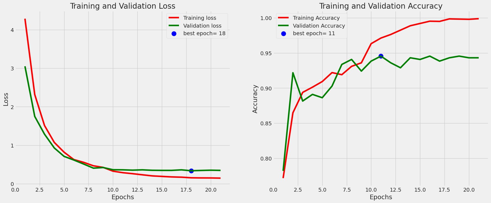
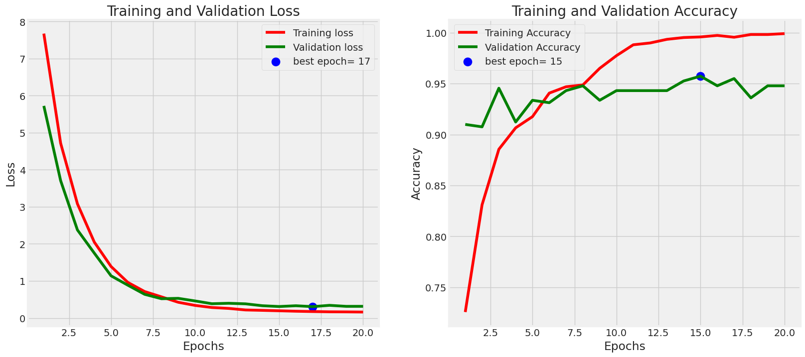
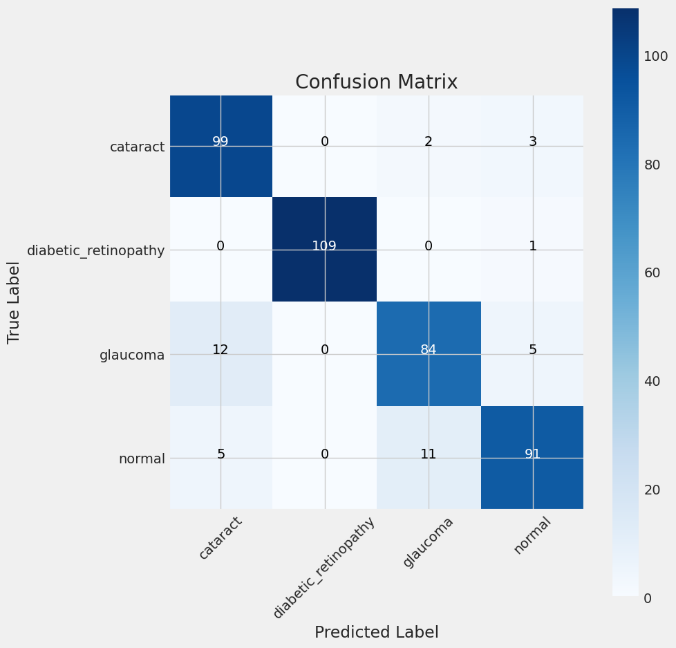
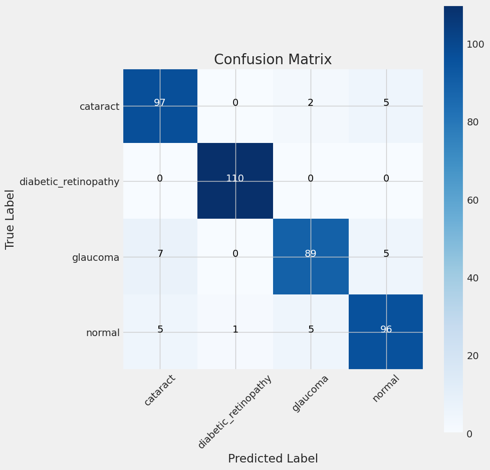
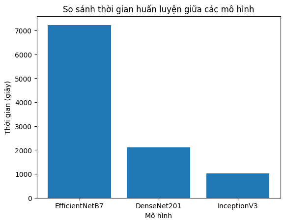

# Dự án phân loại bệnh mắt với AI
- Sử dụng các mô hình AI để thực huấn luyện phân loại một vài loại bệnh về mắt (có cả ảnh khỏe mạnh)
- Tập dữ liệu là các ảnh võng mạc mắt được chia thành 4 thư mục ứng 4 phân loại của dự án
- Lưu ý
    - Các đường dẫn trong các file .ipynb sẽ khác đối với mọi người
    - Dự án này làm việc với TensorFlow 2.9.1
## Mục lục
- [Import](#chuẩn-bị)
- [Dữ liệu](#dữ-liệu)
- [Mô hình](#mô-hình-và-huấn-luyện)
- [Huấn luyện](#huấn-luyện)
- [Kết quả và đánh giá](#kết-quả-và-đánh-giá)
## Chuẩn bị
### Các thư viện cần thiết
- os: hỗ trợ truy xuất dữ liệu trong thư mục
- time: quản lý thời gian huấn luyện mô hình
- Numpy : thống kê quá trình huấn luyện
- Pandas : thống kê dữ liệu
- matplotlib, seaborn và itertools: vẽ và hỗ trợ vẽ biểu đồ đánh giá
- Các thư viện từ scikit-learn(sklearn) và TensorFlow: Hỗ trợ xây dựng các lớp trong mô hình, các hàm tối ưu, mất mát, tiền xử lý ảnh có sẵn, hỗ trợ ổn định mô hình(regularizers)
### Các hàm sử dụng
- Các hàm xử lý dữ liệu đầu vào:
    - define_paths
    - define_df
    - create_gens
- Quản lý và thống kê quá trình huấn luyện
    - on_train_begin
    - on_train_end
    - on_train_batch_end
    - on_epoch_begin
    - on_epoch_end
- Vẽ các biểu đồ đánh giá
    - plot_training
    - plot_confusion_matrix
## Dữ liệu
### Mô tả
- Bộ dữ liệu bao gồm các nhãn phân loại bình thường, Bệnh võng mạc tiểu đường, Đục thủy tinh thể, Bệnh tăng nhãn áp với mỗi nhãn có gần 1000 ảnh. Những ảnh này được thu thập từ nhiều nguồn khác nhau như IDRiD, Oculur recognition, HRF, ...

- URL của Bộ dữ liệu: [eye-diseases-classification](https://www.kaggle.com/datasets/gunavenkatdoddi/eye-diseases-classification)
### Chia dữ liệu
- Bộ dữ liệu được chia theo tỉ lệ 8/1/1 để huấn luyện
## Mô hình và huấn luyện
### Các mô hình
- Các mô hình được sử dụng
    - EfficientNetB7
    - DenseNet201
    - InceptionV3
### Huấn luyện
- Các tham số huấn luyện
    - Hàm tối ưu: Adamax
    - Hàm mất mát: categorical_crossentropy
    - Batch size: 8
    - Epoch tối đa: 100
    - Đợi: 
        - Tối đa 1 epoch đối với việc thay đổi learning rate sau khi mô hình không cải thiện 
        - tối đa 3 epoch đối vội dừng huấn luyện sau khi mô hình không cải thiện dù đã tác động vào learning rate
- InceptionV3:
    - Huấn luyện dừng ở epoch thứ 16 sau 3 lần tác động vào learning rate
    - Thời gian tiêu tốn 17 phút 43 giây
- DenseNet201:
    - Huấn luyện dừng ở epoch thứ 21 sau 3 lần tác động vào learning rate
    - Thời gian tiêu tốn 35 phút 18 giây
- EfficientNetB7:
    - Huấn luyện dừng ở epoch thứ 20 sau 3 lần tác động vào learning rate
    - Thời gian tiêu tốn 2 tiếng 1 phút
## Kết quả và đánh giá
- Kết quả huấn luyện:
    - InceptionV3
    
    - DenseNet201
    
    - EfficientNetB7
    
- Ma trận nhầm lẫn:
    - InceptionV3
    
    - DenseNet201
    
    - EfficientNetB7
    
- Kết quả kiểm thử:
    - InceptionV3
    
    - DenseNet201
    
    - EfficientNetB7
    
- Thời gian huấn luyện giữa các mô hình
    
    